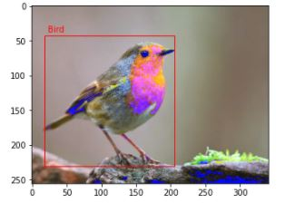

## Object_Detection
Detect bird in photo

- Using Detecto library(Faster R-CNN ResNet-50 FPN architecture) 
/n Detecto is a Python library built on top of PyTorch that simplifies the process of building object detection models

